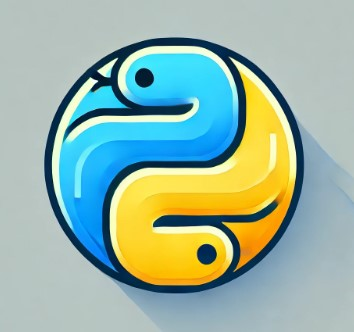

#    Desarrollo Web en Python 

## Apuntes sacados de :   IBM skillsBuild

| [Fundamentos de Internet](./fundamentosInternet/README.md) | [Fundamentos de Programación](./fundamentosProgramacion/README.md) | [Fundamentos de Desarrollo Web](#) | [Fundamentos de Git y Github](#)
|----------------------------------------------------------------|------------------------------------------|-----------------------------------------------------------------|------------------------------------------|